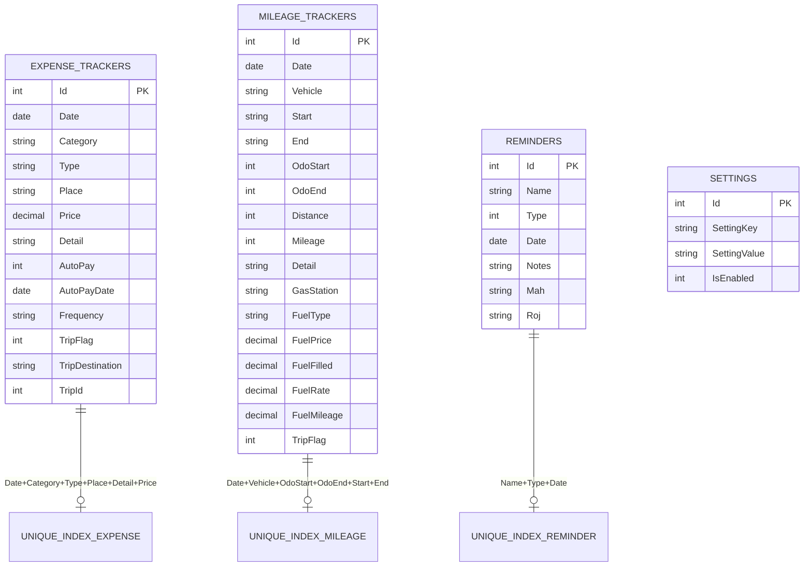
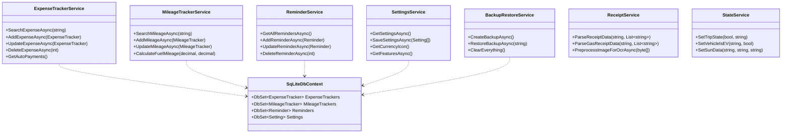
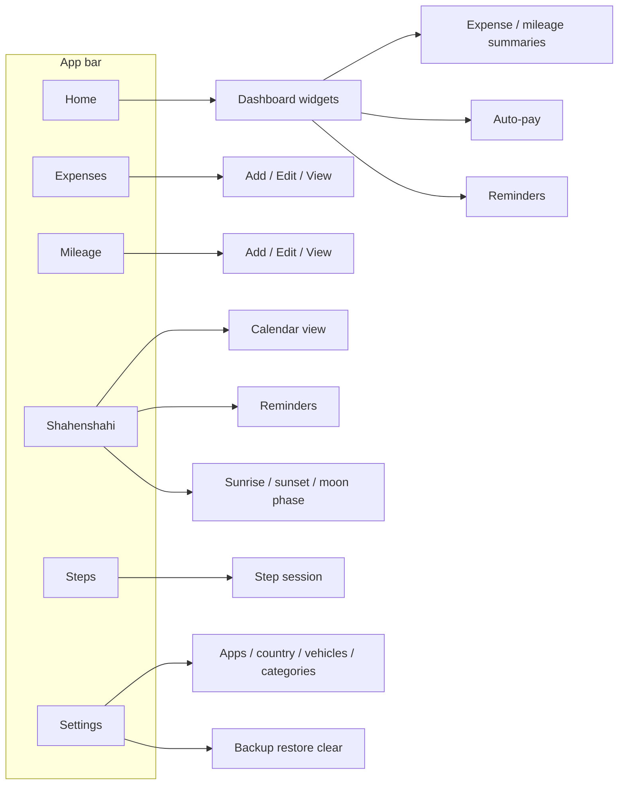
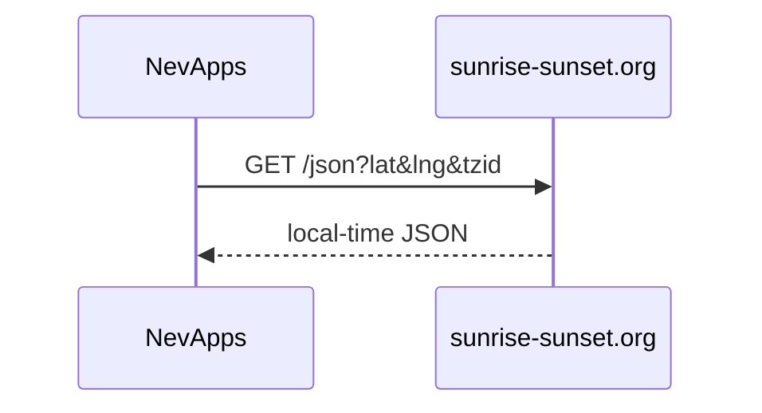

# NevApps Architecture

> **Status:** Public &nbsp;|&nbsp; **Database:** SQLite 3 &nbsp;|&nbsp; **Framework:** .NET 10 / MAUI Blazor Hybrid

Two projects in this repo:

| Project | Role |
| :--- | :--- |
| `NevDBClass` | EF Core models, `SqLiteDbContext`, migrations |
| `NevApps` | MAUI UI (MudBlazor), services, platform code |

The SQLite file lives on-device (`NevDB.db3`). Sunrise/sunset uses [sunrise-sunset.org](https://sunrise-sunset.org/api). Moon phase is computed on-device with CoordinateSharp.

---

## Database schema

`Reminder.Type` is stored as an int (`Anniversary`, `Birthday`, `Consecration`, `Death` — order is fixed). Dates are `DateOnly` stored as `yyyy-MM-dd` text.

---

## Services

Receipt scan is on-device: `Plugin.Maui.OCR` + `ReceiptService` parsers.

`StateService` uses `Microsoft.Maui.Storage.Preferences` (trip flag, EV vehicles, cached sunrise/sunset). It is not SQLite.

---

## Navigation

Top app bar icons are shown only when the matching feature is enabled in Settings.

There is no separate theme screen. Backup/restore is local only.

---

## External APIs

Shahenshahi dates, Muhurat, and moon phase are computed on-device (`ShenshaiCalendar`, `Muhurat`, CoordinateSharp).

---

## Build configurations

`Debug` and `Release`. Store signing is **not** in the csproj. Copy `Directory.Build.props.example` to gitignored `Directory.Build.props` on the machine that publishes.
